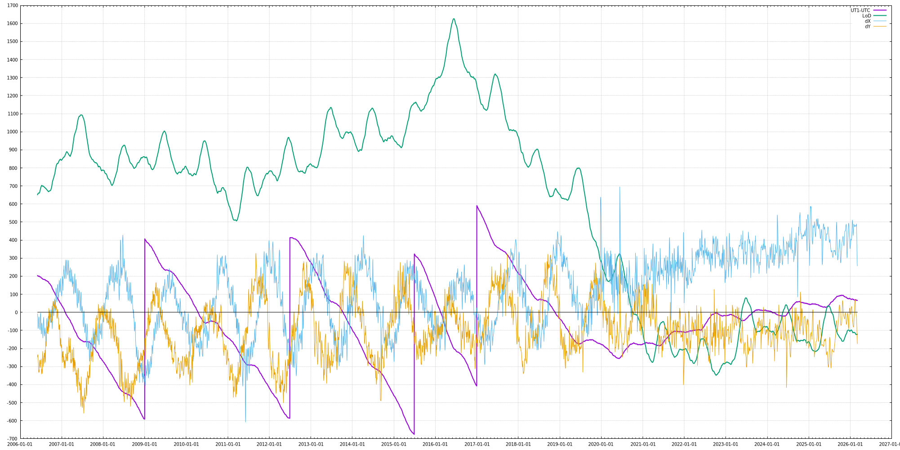

When will the next leap second happen?
======================================

> the results from this code are discussed in a twitter thread
> https://twitter.com/fanf/status/1386838657093586944

The IERS publishes a number of bulletins about UTC and leap seconds.

https://www.iers.org/IERS/EN/Publications/Bulletins/bulletins.html

Bulletin C (twice a year) announces whether a leap second will or won't
happen.

Bulletin A (weekly, every Thursday) contains detailed predictions of
how UT1 (earth rotation angle) will differ from UTC for the next year.

When UT1-UTC grows significantly more than half a second, a leap
second is announced to keep them close together.

Historically, UT1-UTC has always decreased, and leap seconds have
always been positive. But at the moment, UT1-UTC is increasing. If
this continues long enough, there could be a negative leap second.

As well as a table of predictions for the next year, Bulletin A also
contains a simple formula that can be used for more long-term
projections. We can use this formua to estimate when the next leap
second might happen.

It isn't clear to me how far into the future it is sensible to use
this formula. The formula changes from week to week, so I thought it
would be informative to see how the prediction for the next leap
second changes in each issue of Bulletin A.

this program
------------

This repository contains a Rust program that downloads Bulletin A,
parses it, and calculates a forecast of when the next leap second
might happen.

If you type `cargo run` you should see output like:

		Finished dev [unoptimized + debuginfo] target(s) in 0.04s
		 Running `target/debug/bulletin-a`
	fetching https://datacenter.iers.org/data/6/bulletina-xxxiv-017.txt
	2021-04-29 -> 2028-06-30 (-) UT1-UTC +0.514 ± 0.092 s (lod -260 µs)

The first date is the date of the latest Bulletin A.

The second date is when the next leap second might happen. A row of
question marks indicates that there is no leap second in the
foreseeable future.

The `(+)` or `(-)` indicates whether it is predicted to be a positive
or negative leap second.

Then follow some numbers showing the forecast difference between UT1
and UTC at the time of the leap second, and the accuracy of the
forecast.

Finally is the length-of-day value used by the prediction formula,
given as microseconds different from 24 * 60 * 60 seconds. Until
recently this number has been positive.

options
-------

  * type `cargo run 50`

    to show forecasts from the last 50 issues of Bulletin A

	by default one is shown

  * type `cargo run 1 0.75`

	to use a threshold of 0.75 seconds when forecasting the next leap
    second; a leap second is predicted when UT1-UTC grows more than
    this threshold

	by default the threshold is 0.60 seconds

charts
------

This repository also contains horrible perl and gnuplot scripts
`lod.pl` and `lod.gnuplot` that draw a chart of

  * UT1-UTC in milliseconds (purple)

  * length of day averaged over the previous 300 days,
    in microseconds difference from 24 hours (green)

  * earth nutation parameters dX and dY, in microarcseconds (blue and orange)

To view the chart, run

	curl -O https://datacenter.iers.org/data/json/finals2000A.data.json
    gnuplot lod.gnuplot

The main purpose of the chart is to visualize the trends in UT1-UTC
and the LoD. UT1-UTC is the integral of the LoD; while the green line
is below zero the purple line trends upwards.

(The "finals" data measures the LoD with submicrosecond resolution, a
lot better than the Bulletin A prediction's 10 µs.)

The chart also shows that around the same time in 2020 that the LoD
dropped below 24h, the nutation changed behaviour. It's unclear what
this indicates or what the cause might be.

licence
-------

> This code was written by Tony Finch <<dot@dotat.at>>  
> You may do anything with this. It has no warranty.  
> <https://creativecommons.org/publicdomain/zero/1.0/>  
> SPDX-License-Identifier: CC0-1.0
